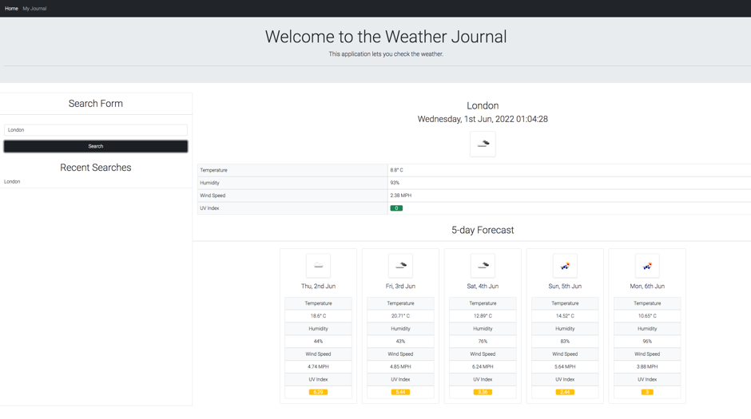
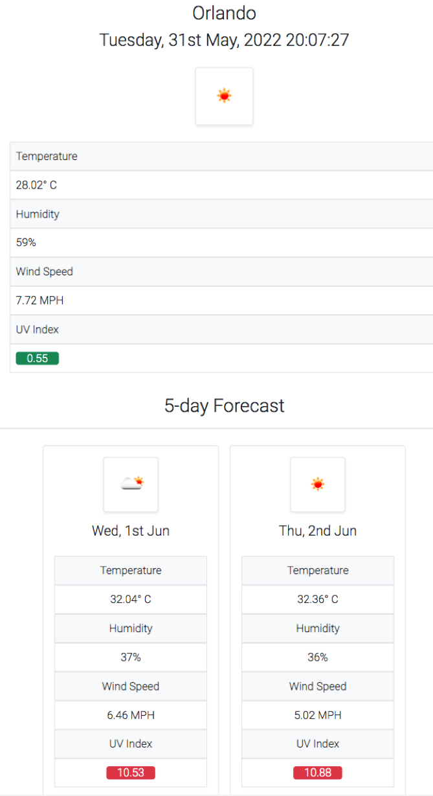
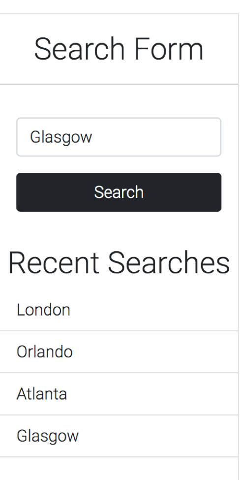
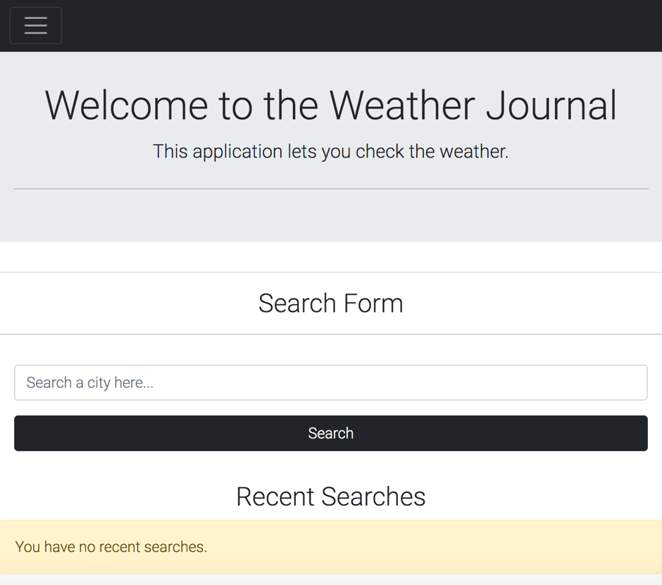

# Weather Journal

A dashboard for viewing the 5 day weather forecast of a particular city.

The user can search the name of a city and the current weather data is displayed, as well as the predicted weather conditions over 5 consecutive days.

# Deployed Page

View the deployed weather journal here: https://sophia4422.github.io/weather-journal-new/

View the Github repository here: https://github.com/sophia4422/weather-journal-new/tree/dev

# User Journey

The user can search for a city of their choosing in the search bar.

They will be presented with the current and future weather conditions for that city.

The date of the forecast, the temperature, humidity, windspeed and UV index are displayed. A corresponding weather icon is also shown.

The user's search history is saved in local storage and displayed on the page.

If the user is a first time visitor of the page then a display box to say 'You have no recent searches' is shown.

# Resources and Technologies

-Moment.js
-Fontawesome
-Coolors
-Bootstrap
-Open Weather Map API
-HTML
-CSS
-Javascript
